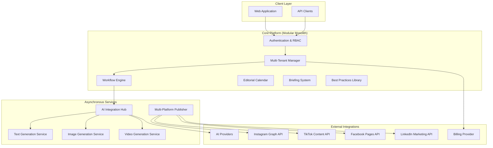

# Design Document: Content Automation Platform

## Overview

The Content Automation Platform is a comprehensive SaaS solution that leverages AI to automate content creation, approval workflows, and multi-platform publishing. The system follows a modular monolith architecture with asynchronous AI services, supporting complete white-label customization and hierarchical multi-tenancy (Platform > Agency > Client).

The platform integrates with major social media APIs (Instagram Graph API, TikTok Content API, Facebook Pages API, LinkedIn Marketing API) and multiple AI providers to deliver end-to-end content automation while maintaining human oversight through structured approval workflows.

## Architecture

### High-Level Architecture



### Multi-Tenant Architecture Pattern

Based on research, the platform implements a **Bridge Model** (shared database, separate schemas) for optimal balance between isolation, cost, and performance:

- **Platform Level**: Master database with global configurations
- **Agency Level**: Dedicated schema per agency with complete data isolation
- **Client Level**: Row-level security within agency schema using client_id

This approach provides strong data isolation while maintaining cost efficiency and operational simplicity.

### Technology Stack

- **Backend**: Node.js with TypeScript, Express.js framework
- **Database**: PostgreSQL with row-level security and schema-per-tenant
- **Message Queue**: Redis for asynchronous job processing
- **Authentication**: JWT with OAuth2 integration
- **File Storage**: AWS S3 for media assets
- **Monitoring**: Application and infrastructure monitoring
- **Deployment**: Containerized with Docker, orchestrated with Kubernetes

## Components and Interfaces

### Core Platform Components

#### Authentication & RBAC Module
```typescript
interface AuthenticationService {
  authenticate(credentials: LoginCredentials): Promise<AuthResult>
  authorize(user: User, resource: Resource, action: Action): Promise<boolean>
  refreshToken(token: string): Promise<TokenPair>
}

interface RoleBasedAccessControl {
  assignRole(userId: string, tenantId: string, role: Role): Promise<void>
  checkPermission(userId: string, permission: Permission): Promise<boolean>
  getRoles(userId: string, tenantId: string): Promise<Role[]>
}
```

#### Multi-Tenant Manager
```typescript
interface TenantManager {
  createTenant(config: TenantConfig): Promise<Tenant>
  getTenantContext(request: Request): Promise<TenantContext>
  isolateData(query: DatabaseQuery, tenantId: string): DatabaseQuery
  provisionResources(tenantId: string): Promise<void>
}

interface WhiteLabelService {
  applyBranding(tenantId: string, config: BrandConfig): Promise<void>
  generateCustomDomain(tenantId: string, domain: string): Promise<void>
  customizeEmailTemplates(tenantId: string, templates: EmailTemplate[]): Promise<void>
}
```

#### Briefing System
```typescript
interface BriefingService {
  createBriefing(briefing: BriefingData): Promise<Briefing>
  validateBriefing(briefingId: string): Promise<ValidationResult>
  versionBriefing(briefingId: string, changes: Partial<BriefingData>): Promise<Briefing>
  associateContent(briefingId: string, contentId: string): Promise<void>
}

interface BriefingTemplate {
  id: string
  name: string
  fields: BriefingField[]
  requiredFields: string[]
  tenantId: string
}
```

#### Workflow Engine
```typescript
interface WorkflowEngine {
  createWorkflow(contentId: string): Promise<Workflow>
  transitionState(workflowId: string, newState: WorkflowState): Promise<void>
  addComment(workflowId: string, comment: Comment): Promise<void>
  requestApproval(workflowId: string, approvers: string[]): Promise<void>
  getWorkflowHistory(workflowId: string): Promise<WorkflowEvent[]>
}

enum WorkflowState {
  RESEARCH = 'research',
  PLANNING = 'planning',
  CONTENT = 'content',
  CREATIVE = 'creative',
  BRAND_APPLY = 'brand_apply',
  COMPLIANCE_CHECK = 'compliance_check',
  APPROVAL = 'approval',
  PUBLISH = 'publish',
  MONITOR = 'monitor'
}
```

### Asynchronous Services

#### AI Integration Hub
```typescript
interface AIIntegrationHub {
  registerProvider(provider: AIProvider): Promise<void>
  testConnectivity(providerId: string): Promise<HealthCheck>
  routeRequest(request: AIRequest): Promise<AIResponse>
  monitorUsage(tenantId: string): Promise<UsageMetrics>
}

interface AIProvider {
  id: string
  name: string
  capabilities: AICapability[]
  authenticate(credentials: ProviderCredentials): Promise<boolean>
  generateContent(prompt: string, options: GenerationOptions): Promise<GeneratedContent>
}
```

#### Multi-Platform Publisher
```typescript
interface PublisherService {
  publishContent(content: Content, platforms: Platform[]): Promise<PublishResult[]>
  scheduleContent(content: Content, schedule: Schedule): Promise<void>
  adaptContent(baseContent: Content, platform: Platform): Promise<AdaptedContent>
  validatePlatformRequirements(content: Content, platform: Platform): Promise<ValidationResult>
}

interface PlatformAdapter {
  platform: Platform
  authenticate(credentials: PlatformCredentials): Promise<boolean>
  publish(content: AdaptedContent): Promise<PublishResult>
  getRequirements(): ContentRequirements
}
```

## Data Models

### Core Entities

```typescript
interface Tenant {
  id: string
  name: string
  type: 'platform' | 'agency' | 'client'
  parentId?: string
  brandConfig: BrandConfig
  settings: TenantSettings
  createdAt: Date
  updatedAt: Date
}

interface User {
  id: string
  email: string
  name: string
  tenantId: string
  roles: Role[]
  permissions: Permission[]
  isActive: boolean
  lastLoginAt?: Date
}

interface Briefing {
  id: string
  title: string
  type: 'internal' | 'external'
  templateId: string
  fields: Record<string, any>
  version: number
  status: 'draft' | 'active' | 'archived'
  tenantId: string
  clientId?: string
  createdBy: string
  createdAt: Date
  updatedAt: Date
}

interface Content {
  id: string
  briefingId: string
  title: string
  description: string
  contentType: 'text' | 'image' | 'video' | 'carousel'
  baseContent: ContentData
  adaptedContent: Record<Platform, AdaptedContent>
  workflowId: string
  tenantId: string
  clientId?: string
  createdBy: string
  createdAt: Date
  updatedAt: Date
}

interface Workflow {
  id: string
  contentId: string
  currentState: WorkflowState
  stateHistory: WorkflowEvent[]
  comments: Comment[]
  approvals: Approval[]
  tenantId: string
  createdAt: Date
  updatedAt: Date
}

interface BestPractice {
  id: string
  name: string
  contentType: string
  objective: string
  rules: string[]
  examples: {
    positive: string[]
    negative: string[]
  }
  priority: number
  isCustom: boolean
  tenantId?: string
  createdAt: Date
}
```

### Platform-Specific Models

```typescript
interface InstagramContent extends AdaptedContent {
  aspectRatio: '1:1' | '4:5' | '9:16'
  mediaType: 'photo' | 'video' | 'carousel'
  caption: string
  hashtags: string[]
  location?: string
}

interface TikTokContent extends AdaptedContent {
  videoFile: string
  duration: number
  effects: string[]
  sounds: string[]
  hashtags: string[]
  privacy: 'public' | 'friends' | 'private'
}

interface LinkedInContent extends AdaptedContent {
  postType: 'article' | 'update' | 'video'
  title?: string
  content: string
  mediaUrls: string[]
  targetAudience: 'connections' | 'public'
}
```

## Correctness Properties

*A property is a characteristic or behavior that should hold true across all valid executions of a system—essentially, a formal statement about what the system should do. Properties serve as the bridge between human-readable specifications and machine-verifiable correctness guarantees.*

### Property Reflection

After analyzing all acceptance criteria, several properties can be consolidated to eliminate redundancy:

- **Tenant isolation properties** (1.2, 3.3) can be combined into a comprehensive data isolation property
- **Audit logging properties** (1.5, 3.5, 13.4) can be unified into a single audit trail property  
- **Version history properties** (4.4, 4.5, 5.2) can be consolidated into a general versioning property
- **Error handling properties** (6.5, 7.5, 14.5) can be combined into a unified error handling property
- **Content adaptation properties** (7.2, 14.2) can be merged into a single adaptation property

### Core Properties

**Property 1: Hierarchical Tenant Data Isolation**
*For any* database query and tenant context, the query should only return data belonging to the requesting tenant and its authorized sub-tenants, never data from sibling or parent tenants
**Validates: Requirements 1.1, 1.2, 3.3**

**Property 2: Tenant Resource Provisioning**
*For any* new agency creation, the system should provision isolated database schema and resources that are completely separate from other agencies
**Validates: Requirements 1.3**

**Property 3: Briefing Association Enforcement**
*For any* content creation request, the system should reject the request if no active briefing is associated with the content
**Validates: Requirements 4.2**

**Property 4: Workflow State Transition Control**
*For any* content workflow, transitioning to the Publish state should only succeed if all required approvals have been completed
**Validates: Requirements 5.3, 5.5**

**Property 5: White-Label Branding Consistency**
*For any* agency tenant and UI component, the rendered interface should consistently display the agency's configured branding elements (logo, colors, typography)
**Validates: Requirements 2.1, 2.3, 2.5**

**Property 6: Permission Enforcement**
*For any* user action and resource, the system should only allow the action if the user has the required permissions for that resource within their tenant scope
**Validates: Requirements 3.2, 3.4**

**Property 7: Multi-Platform Content Adaptation**
*For any* base content and target platform, the adapted content should conform to the platform's specific requirements (dimensions, format, character limits)
**Validates: Requirements 7.2, 14.2**

**Property 8: AI Provider Abstraction**
*For any* AI generation request, the system should be able to route the request to any configured provider through a unified interface
**Validates: Requirements 6.3**

**Property 9: Scheduling Conflict Prevention**
*For any* content scheduling request, the system should reject requests that would create double-booking or conflicts with existing scheduled content
**Validates: Requirements 8.5**

**Property 10: Video Script Structure Completeness**
*For any* generated video script, the script should contain all required sections: hook, storytelling, tone, emotions, and CTA
**Validates: Requirements 9.1**

**Property 11: Best Practices Application**
*For any* content generation request, the system should apply relevant best practices from the tenant's configuration to the generation prompts
**Validates: Requirements 10.2**

**Property 12: Comprehensive Audit Trail**
*For any* user action within a tenant, the system should create an audit log entry that includes user, action, resource, timestamp, and tenant context
**Validates: Requirements 1.5, 3.5, 13.4**

**Property 13: Version History Preservation**
*For any* update to briefings, workflows, or scripts, the system should preserve the previous version and maintain a complete history
**Validates: Requirements 4.4, 4.5, 5.2**

**Property 14: Billing Credit Tracking**
*For any* AI service usage, the system should accurately track and bill credits according to the tenant's plan limits
**Validates: Requirements 12.2**

**Property 15: Data Encryption Compliance**
*For any* sensitive data (tokens, personal information, credentials), the system should encrypt the data both at rest and in transit
**Validates: Requirements 13.1, 13.5**

**Property 16: Error Handling with Alternatives**
*For any* failed operation (AI generation, publishing, service calls), the system should provide clear error messages and suggest alternative actions when possible
**Validates: Requirements 6.5, 7.5, 14.5**

<function_calls>
<invoke name="prework">
<parameter name="featureName">content-automation-platform

## Error Handling

### Error Classification

The platform implements a comprehensive error handling strategy with the following categories:

#### System Errors
- **Database Connection Failures**: Automatic retry with exponential backoff
- **Service Unavailability**: Circuit breaker pattern with fallback mechanisms
- **Resource Exhaustion**: Graceful degradation with user notification

#### Business Logic Errors
- **Validation Failures**: Clear error messages with field-specific feedback
- **Permission Denied**: Detailed authorization error with suggested actions
- **Workflow Violations**: State transition errors with valid next steps

#### External Service Errors
- **AI Provider Failures**: Automatic failover to alternative providers
- **Social Platform API Errors**: Retry logic with platform-specific error handling
- **Billing Service Errors**: Queue failed transactions for retry

#### User Input Errors
- **Invalid Content Format**: Format validation with correction suggestions
- **Missing Required Fields**: Field-level validation with completion guidance
- **File Upload Errors**: Size and format validation with alternative options

### Error Recovery Strategies

```typescript
interface ErrorRecoveryStrategy {
  retryPolicy: RetryPolicy
  fallbackMechanism: FallbackMechanism
  userNotification: NotificationStrategy
  auditLogging: AuditStrategy
}

interface RetryPolicy {
  maxAttempts: number
  backoffStrategy: 'exponential' | 'linear' | 'fixed'
  retryableErrors: ErrorCode[]
}
```

## Testing Strategy

### Dual Testing Approach

The platform requires both unit testing and property-based testing for comprehensive coverage:

#### Unit Testing Focus
- **Specific Examples**: Test concrete scenarios and edge cases
- **Integration Points**: Verify component interactions and API integrations
- **Error Conditions**: Test specific error scenarios and recovery mechanisms
- **Business Logic**: Validate specific business rules and calculations

#### Property-Based Testing Focus
- **Universal Properties**: Verify properties that hold across all inputs
- **Data Integrity**: Test data consistency and isolation across random inputs
- **Security Properties**: Verify access control and data protection universally
- **Workflow Invariants**: Test workflow state consistency across all transitions

### Property-Based Testing Configuration

- **Testing Framework**: fast-check for TypeScript/Node.js
- **Test Iterations**: Minimum 100 iterations per property test
- **Test Tagging**: Each property test must reference its design document property
- **Tag Format**: `// Feature: content-automation-platform, Property {number}: {property_text}`

### Testing Requirements by Component

#### Multi-Tenant Architecture
- **Unit Tests**: Specific tenant creation and isolation scenarios
- **Property Tests**: Data isolation across random tenant configurations

#### AI Integration Hub
- **Unit Tests**: Specific provider integrations and error scenarios
- **Property Tests**: Request routing and failover across random provider configurations

#### Workflow Engine
- **Unit Tests**: Specific state transitions and approval scenarios
- **Property Tests**: Workflow invariants across random state sequences

#### Content Publishing
- **Unit Tests**: Specific platform adaptations and publishing scenarios
- **Property Tests**: Content adaptation consistency across random content types

### Test Data Management

- **Tenant Isolation**: Each test runs in isolated tenant context
- **Data Cleanup**: Automatic cleanup of test data after execution
- **Realistic Data**: Use production-like data structures and volumes
- **Security Testing**: Include tests with malicious inputs and edge cases

The testing strategy ensures both concrete functionality validation through unit tests and universal correctness guarantees through property-based testing, providing comprehensive coverage for this complex multi-tenant platform.